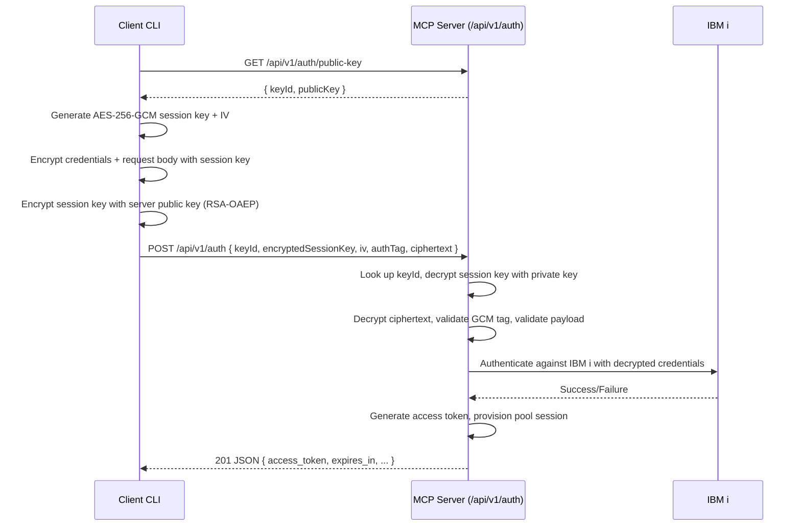

<div align="center">

# ibmi-mcp-server

**MCP server for IBM i**

[](https://www.typescriptlang.org/)
[](https://github.com/modelcontextprotocol/typescript-sdk)
[](https://github.com/modelcontextprotocol/modelcontextprotocol/blob/main/docs/specification/2025-06-18/changelog.mdx)
[](./CHANGELOG.md)
[](./vitest.config.ts)
[](https://opensource.org/licenses/Apache-2.0)
[](https://github.com/IBM/ibmi-mcp-server.git)
[](https://github.com/cyanheads/mcp-ts-template)

**📚 [Documentation](https://ibm-d95bab6e.mintlify.app/) | ⚠️ Docs are under active development**

</div>

<details>
<summary><strong>📋 Table of Contents</strong></summary>

- [ibmi-mcp-server](#ibmi-mcp-server)
  - [✨ Key Features](#-key-features)
  - [Quick Start](#quick-start)
    - [1. Installation](#1-installation)
    - [2. Build the Project](#2-build-the-project)
    - [3. Create Server .env File](#3-create-server-env-file)
    - [4. Running the Server](#4-running-the-server)
    - [5. Run Example Agent](#5-run-example-agent)
      - [Run the example Agent:](#run-the-example-agent)
      - [Run the Example Scripts:](#run-the-example-scripts)
    - [6. Running Tests](#6-running-tests)
  - [⚙️ Configuration](#️-configuration)
  - [IBM i HTTP Authentication (Beta)](#ibm-i-http-authentication-beta)
    - [Authentication Flow](#authentication-flow)
    - [Configuration](#configuration)
    - [Getting Access Tokens](#getting-access-tokens)
      - [Option 1: Using the Token Script (Recommended)](#option-1-using-the-token-script-recommended)
      - [Sequence Overview](#sequence-overview)
    - [Client Integration](#client-integration)
    - [Security Considerations](#security-considerations)
    - [Authentication Endpoints](#authentication-endpoints)
  - [SQL Tool Configuration](#sql-tool-configuration)
    - [Sources](#sources)
    - [Tools](#tools)
    - [Toolsets](#toolsets)
  - [Running the Server (Development)](#running-the-server-development)
    - [Transport Modes](#transport-modes)
      - [HTTP Transport (Recommended for Development)](#http-transport-recommended-for-development)
      - [Stdio Transport (for CLI tools and MCP Inspector)](#stdio-transport-for-cli-tools-and-mcp-inspector)
    - [Session Modes (HTTP Only)](#session-modes-http-only)
    - [CLI Options](#cli-options)
    - [Common Development Scenarios](#common-development-scenarios)
    - [Development Tips](#development-tips)
    - [Troubleshooting](#troubleshooting)
  - [MCP Inspector](#mcp-inspector)
  - [Docker \& Podman Deployment](#docker--podman-deployment)
    - [Prerequisites](#prerequisites)
      - [Docker](#docker)
      - [Podman (Alternative to Docker)](#podman-alternative-to-docker)
      - [Build MCP Gateway Image](#build-mcp-gateway-image)
      - [Configure MCP environment](#configure-mcp-environment)
    - [Quick Start with Docker](#quick-start-with-docker)
    - [Quick Start with Podman](#quick-start-with-podman)
    - [Container Architecture](#container-architecture)
    - [🔧 Service Management](#-service-management)
      - [Start Services](#start-services)
      - [Stop Services](#stop-services)
      - [View Logs](#view-logs)
      - [Rebuild Services](#rebuild-services)
    - [MCP Gateway UI:](#mcp-gateway-ui)
    - [Virtual Server Catalog Demo (Comming soon!!)](#virtual-server-catalog-demo-comming-soon)
  - [Architecture Overview](#architecture-overview)
  - [🏗️ Project Structure](#️-project-structure)
  - [🧩 Extending the System](#-extending-the-system)
    - [The "Logic Throws, Handler Catches" Pattern](#the-logic-throws-handler-catches-pattern)
  - [🌍 Explore More MCP Resources](#-explore-more-mcp-resources)
  - [📜 License](#-license)

</details>


## ✨ Key Features

| Feature Area                | Description                                                                                                                                          | Key Components / Location                                            |
| :-------------------------- | :--------------------------------------------------------------------------------------------------------------------------------------------------- | :------------------------------------------------------------------- |
| **🔌 MCP Server**           | A functional server with example tools and resources. Supports `stdio` and a **Streamable HTTP** transport built with [**Hono**](https://hono.dev/). | `src/mcp-server/`, `src/mcp-server/transports/`                      |
| **🔭 Observability**        | Built-in **OpenTelemetry** for distributed tracing and metrics. Auto-instrumentation for core modules and custom tracing for all tool executions.    | `src/utils/telemetry/`                                               |
| **🚀 Production Utilities** | Logging, Error Handling, ID Generation, Rate Limiting, Request Context tracking, Input Sanitization.                                                 | `src/utils/`                                                         |
| **🔒 Type Safety/Security** | Strong type checking via TypeScript & Zod validation. Built-in security utilities (sanitization, auth middleware for HTTP).                          | Throughout, `src/utils/security/`, `src/mcp-server/transports/auth/` |
| **⚙️ Error Handling**       | Consistent error categorization (`BaseErrorCode`), detailed logging, centralized handling (`ErrorHandler`).                                          | `src/utils/internal/errorHandler.ts`, `src/types-global/`            |
| **📚 Documentation**        | Comprehensive `README.md`, structured JSDoc comments, API references.                                                                                | `README.md`, Codebase, `tsdoc.json`, `docs/api-references/`          |
| **🕵️ Interaction Logging**  | Captures raw requests and responses for all external LLM provider interactions to a dedicated `interactions.log` file for full traceability.         | `src/utils/internal/logger.ts`                                       |
| **🤖 Agent Ready**          | Includes a [.clinerules](./.clinerules/clinerules.md) developer cheatsheet tailored for LLM coding agents.                                           | `.clinerules/`                                                       |
| **🛠️ Utility Scripts**      | Scripts for cleaning builds, setting executable permissions, generating directory trees, and fetching OpenAPI specs.                                 | `scripts/`                                                           |
| **🧩 Services**             | Reusable modules for LLM (OpenRouter) and data storage (DuckDB) integration, with examples.                                                          | `src/services/`, `src/storage/duckdbExample.ts`                      |
| **🧪 Integration Testing**  | Integrated with Vitest for fast and reliable integration testing. Includes example tests for core logic and a coverage reporter.                     | `vitest.config.ts`, `tests/`                                         |
| **⏱️ Performance Metrics**  | Built-in utility to automatically measure and log the execution time and payload size of every tool call.                                            | `src/utils/internal/performance.ts`                                  |

## Quick Start

### 1. Installation

Clone the repository and install dependencies:

```bash
git clone https://github.com/IBM/ibmi-mcp-server.git
cd ibmi-mcp-server/
npm install
```

### 2. Build the Project

```bash
npm run build
# Or use 'npm run rebuild' for a clean install
```

### 3. Create Server .env File

```bash
cp .env.example .env
```

Fill out the Db2 for i connection details in the `.env` file:

```bash
# IBM i DB2 for i Connection Settings
# Required for YAML SQL tools to connect to IBM i systems
DB2i_HOST=
DB2i_USER=
DB2i_PASS=
DB2i_PORT=8076
DB2i_IGNORE_UNAUTHORIZED=true
```

See more on configuration options in the [Configuration](#⚙️-configuration) section.

### 4. Running the Server

- **Via Stdio (Default):**
  ```bash
  npm run start:stdio
  ```
- **Via Streamable HTTP:**

  ```bash
  npm run start:http
  ```

  By Default, the server registers SQL tools stored in the `prebuiltconfigs` directory. This path is set in the `.env` file (`TOOLS_YAML_PATH`). You can override the SQL tools path using the CLI:
  - CLI Option: `--tools <path>`
    ```bash
    npm run start:http -- --tools <path>
    ```
  - Transport Options: `--transport <type>`
    ```bash
    npm run start:http -- --transport http # or stdio
    ```

### 5. Run Example Agent

Make sure that the server is running in `http` mode:

```bash
npm run start:http
```

In another terminal, navigate to the `tests/agents` directory and follow the setup instructions in the [README](./tests/agents/README.md).

#### Run the example Agent:

```bash
cd tests/agents
uv run agent.py -p "What is my system status?"
```

#### Run the Example Scripts:

```bash
cd tests/agents

# See a list of configured tools:
uv run test_tool_annotations.py -d

# see a list of server resources:
uv run test_toolset_resources.py
```

### 6. Running Tests

This template uses [Vitest](https://vitest.dev/) for testing, with a strong emphasis on **integration testing** to ensure all components work together correctly.

- **Run all tests once:**
  ```bash
  npm test
  ```
- **Run tests in watch mode:**
  ```bash
  npm run test:watch
  ```
- **Run tests and generate a coverage report:**
  ```bash
  npm run test:coverage
  ```

## ⚙️ Configuration

Configure the server using these environment variables (or a `.env` file):

| Variable                              | Description                                                                               | Default                                |
| :------------------------------------ | :---------------------------------------------------------------------------------------- | :------------------------------------- |
| `MCP_TRANSPORT_TYPE`                  | Server transport: `stdio` or `http`.                                                      | `stdio`                                |
| `MCP_SESSION_MODE`                    | Session mode for HTTP: `stateless`, `stateful`, or `auto`.                                | `auto`                                 |
| `MCP_HTTP_PORT`                       | Port for the HTTP server.                                                                 | `3010`                                 |
| `MCP_HTTP_HOST`                       | Host address for the HTTP server.                                                         | `127.0.0.1`                            |
| `MCP_ALLOWED_ORIGINS`                 | Comma-separated allowed origins for CORS.                                                 | (none)                                 |
| `MCP_AUTH_MODE`                       | Authentication mode for HTTP: `jwt`, `oauth`, `ibmi`, or `none`.                          | `none`                                 |
| `MCP_AUTH_SECRET_KEY`                 | **Required for `jwt` mode.** Secret key (min 32 chars) for signing/verifying auth tokens. | (none - **MUST be set in production**) |
| `OAUTH_ISSUER_URL`                    | **Required for `oauth` mode.** The issuer URL of your authorization server.               | (none)                                 |
| `OAUTH_AUDIENCE`                      | **Required for `oauth` mode.** The audience identifier for this MCP server.               | (none)                                 |
| `OPENROUTER_API_KEY`                  | API key for OpenRouter.ai service.                                                        | (none)                                 |
| `OTEL_ENABLED`                        | Set to `true` to enable OpenTelemetry instrumentation.                                    | `false`                                |
| `OTEL_EXPORTER_OTLP_TRACES_ENDPOINT`  | The OTLP endpoint for exporting traces (e.g., `http://localhost:4318/v1/traces`).         | (none; logs to file)                   |
| `OTEL_EXPORTER_OTLP_METRICS_ENDPOINT` | The OTLP endpoint for exporting metrics (e.g., `http://localhost:4318/v1/metrics`).       | (none)                                 |
| `TOOLS_YAML_PATH`                     | Path to YAML tool definitions (file or directory). Supports directories or globs.         | (none)                                 |
| `YAML_MERGE_ARRAYS`                   | When merging multiple YAML files, merge arrays (`true`) instead of replacing them.        | `false`                                |
| `YAML_ALLOW_DUPLICATE_TOOLS`          | Allow duplicate tool names across merged YAML files.                                      | `false`                                |
| `YAML_ALLOW_DUPLICATE_SOURCES`        | Allow duplicate source names across merged YAML files.                                    | `false`                                |
| `YAML_VALIDATE_MERGED`                | Validate the merged YAML configuration before use.                                        | `true`                                 |
| `YAML_AUTO_RELOAD`                    | Enable automatic reloading of YAML tools when configuration files change.                 | `true`                                 |
| `SELECTED_TOOLSETS`                   | Comma-separated list of toolset names to load/filter tools (overrides full load).         | (none)                                 |
| `DB2i_HOST`                           | IBM i Db2 for i host (Mapepire daemon or gateway host).                                   | (none)                                 |
| `DB2i_USER`                           | IBM i user profile for Db2 for i connections.                                             | (none)                                 |
| `DB2i_PASS`                           | Password for the IBM i user profile.                                                      | (none)                                 |
| `DB2i_PORT`                           | Port for the Mapepire daemon/gateway used for Db2 for i.                                  | `8076`                                 |
| `DB2i_IGNORE_UNAUTHORIZED`            | If `true`, skip TLS certificate verification for Mapepire (self-signed certs, etc.).      | `true`                                 |
| `IBMI_HTTP_AUTH_ENABLED`              | **Required for `ibmi` auth mode.** Enable IBM i HTTP authentication endpoints.            | `false`                                |
| `IBMI_AUTH_ALLOW_HTTP`                | Allow HTTP requests for authentication (development only, use HTTPS in production).       | `false`                                |
| `IBMI_AUTH_TOKEN_EXPIRY_SECONDS`      | Default token lifetime in seconds for IBM i authentication tokens.                        | `3600` (1 hour)                        |
| `IBMI_AUTH_CLEANUP_INTERVAL_SECONDS`  | How often to clean expired tokens (in seconds).                                           | `300` (5 minutes)                      |
| `IBMI_AUTH_MAX_CONCURRENT_SESSIONS`   | Maximum number of concurrent authenticated sessions allowed.                              | `100`                                  |

To set the server environment variables, create a `.env` file in the root of this project:

```bash
cp .env.example .env
code .env
```

Then edit the `.env` file with your IBM i connection details.

## IBM i HTTP Authentication (Beta)

The server supports IBM i HTTP authentication that allows clients to obtain access tokens for authenticated SQL tool execution. This enables per-user connection pooling and secure access to IBM i resources.

### Authentication Flow

1. **Client Authentication**: Clients authenticate with IBM i credentials via HTTP Basic Auth
2. **Token Generation**: Server creates a secure Bearer token and establishes a dedicated connection pool
3. **Tool Execution**: Subsequent tool calls use the Bearer token for authenticated execution
4. **Pool Management**: Each token maintains its own connection pool for isolation and security

### Configuration

To enable IBM i HTTP authentication, we need to set up Encryption keys and configure the server environment. To protect IBM i credentials during transmission, the authentication flow uses RSA and AES encryption. You need to generate an RSA keypair for the server:

```bash
mkdir -p secrets
openssl genpkey -algorithm RSA -out secrets/private.pem -pkeyopt rsa_keygen_bits:2048
openssl rsa -pubout -in secrets/private.pem -out secrets/public.pem
```

Create or update your `.env` file with the following settings:

```ini
# Enable IBM i authentication system
IBMI_HTTP_AUTH_ENABLED=true
MCP_AUTH_MODE=ibmi

# IBM i authentication settings
IBMI_AUTH_KEY_ID=development
IBMI_AUTH_PRIVATE_KEY_PATH=secrets/private.pem
IBMI_AUTH_PUBLIC_KEY_PATH=secrets/public.pem

# Security settings
IBMI_AUTH_ALLOW_HTTP=true          # Development only - use HTTPS in production
IBMI_AUTH_TOKEN_EXPIRY_SECONDS=3600 # Token lifetime (1 hour)

# Resource management
IBMI_AUTH_MAX_CONCURRENT_SESSIONS=100
IBMI_AUTH_CLEANUP_INTERVAL_SECONDS=300

# IBM i connection details
DB2i_HOST=your-ibmi-host
DB2i_USER=your-username
DB2i_PASS=your-password
```


### Getting Access Tokens

#### Option 1: Using the Token Script (Recommended)

Use the included `get-access-token.js` script to obtain authentication tokens:

```bash
# Using credentials from .env file
node get-access-token.js --verbose

# Using CLI arguments (overrides .env)
node get-access-token.js --user myuser --password mypass --host my-ibmi-host

# Quiet mode for shell evaluation
eval $(node get-access-token.js --quiet)
echo $IBMI_MCP_ACCESS_TOKEN
```

The script automatically:

- Loads IBM i credentials from `.env` with CLI fallback
- Fetches the server's public key
- Encrypts credentials client-side
- Requests an access token
- Sets `IBMI_MCP_ACCESS_TOKEN` environment variable
- Provides copy-paste export commands

#### Sequence Overview



### Client Integration

Once you have a token, use it in your MCP client to authenticate requests:

```python
import asyncio
import os
from mcp import ClientSession
from mcp.client.streamable_http import streamablehttp_client

async def main():
    # Get the access token from environment
    token = os.environ.get('IBMI_MCP_ACCESS_TOKEN')
    if not token:
        raise ValueError("IBMI_MCP_ACCESS_TOKEN environment variable not set")

    # Set up authentication headers
    headers = {"Authorization": f"Bearer {token}"}

    # Connect to the IBM i MCP server with authentication
    async with streamablehttp_client(
        "http://localhost:3010/mcp",
        headers=headers
    ) as (read_stream, write_stream, _):
        # Create a session using the authenticated streams
        async with ClientSession(read_stream, write_stream) as session:
            # Initialize the connection
            await session.initialize()

            # List available tools (now authenticated with your IBM i credentials)
            tools = await session.list_tools()
            print(f"Available tools: {[tool.name for tool in tools.tools]}")

            # Execute a tool with authenticated IBM i access
            result = await session.call_tool("system_status", {})
            print(f"System status result: {result}")

if __name__ == "__main__":
    asyncio.run(main())
```

### Security Considerations

**Development Environment:**

- `IBMI_AUTH_ALLOW_HTTP=true` allows HTTP for testing
- Use localhost/trusted networks only
- Shorter token lifetimes for testing

**Production Environment:**

- `IBMI_AUTH_ALLOW_HTTP=false` enforces HTTPS
- Use proper TLS certificates
- Longer token lifetimes for stability
- Network security and access controls
- Monitor `IBMI_AUTH_MAX_CONCURRENT_SESSIONS` for resource usage

### Authentication Endpoints

When enabled (`IBMI_HTTP_AUTH_ENABLED=true`), the server provides these endpoints:

| Endpoint       | Method | Description                                                  |
| -------------- | ------ | ------------------------------------------------------------ |
| `/api/v1/auth` | POST   | Authenticate with IBM i credentials and receive Bearer token |

## SQL Tool Configuration

The Primary way to confgure tools used by this MCP server is through `tools.yaml` files (see `prebuiltconfigs/` for examples). There are 3 main sections to each yaml file: `sources`, `tools`, and `toolsets`. Below is a breakdown of each section

### Sources

The sources section of your `tools.yaml` defines the data sources the MCP server has access to

```yaml
sources:
  ibmi-system:
    host: ${DB2i_HOST}
    user: ${DB2i_USER}
    password: ${DB2i_PASS}
    port: 8076
    ignore-unauthorized: true
```

> [!NOTE]
> The environment variables `DB2i_HOST`, `DB2i_USER`, `DB2i_PASS`, and `DB2i_PORT` can be set in the server `.env` file. see [Configuration](#⚙️-configuration)

### Tools

The tools section of your tools.yaml defines the actions your agent can take: what kind of tool it is, which source(s) it affects, what parameters it uses, etc.

```yaml
tools:
  system_status:
    source: ibmi-system
    description: "Overall system performance statistics with CPU, memory, and I/O metrics"
    parameters: []
    statement: |
      SELECT * FROM TABLE(QSYS2.SYSTEM_STATUS(RESET_STATISTICS=>'YES',DETAILED_INFO=>'ALL')) X
```

### Toolsets

The toolsets section of your `tools.yaml` allows you to define groups of tools that you want to be able to load together. This can be useful for defining different sets for different agents or different applications.

```yaml
toolsets:
  performance:
    tools:
      - system_status
      - system_activity
      - remote_connections
      - memory_pools
      - temp_storage_buckets
      - unnamed_temp_storage
      - http_server
      - system_values
      - collection_services
      - collection_categories
      - active_job_info
```

More documentation on SQL tools coming soon!

## Running the Server (Development)

The server supports multiple transport modes and session configurations for different development scenarios. Use the appropriate startup command based on your needs.

### Transport Modes

#### HTTP Transport (Recommended for Development)

```bash
# Basic HTTP server
npm run start:http

# HTTP with custom tools path
npm run start:http -- --tools ./my-configs

# HTTP with specific toolsets
npm run start:http -- --toolsets performance,monitoring
```

#### Stdio Transport (for CLI tools and MCP Inspector)

```bash
# Basic stdio transport
npm run start:stdio

# Stdio with custom tools path
npm run start:stdio -- --tools ./my-custom-tools
```

### Session Modes (HTTP Only)

The `MCP_SESSION_MODE` environment variable controls how the HTTP server handles client sessions:

- **`auto` (default)**: Automatically detects client capabilities and uses the best session mode
- **`stateful`**: Maintains persistent sessions with connection state
- **`stateless`**: Each request is independent, no session state maintained

```bash
# Set session mode via environment variable
MCP_SESSION_MODE=stateful npm run start:http

# Or set in .env file
echo "MCP_SESSION_MODE=stateful" >> .env
npm run start:http
```

### CLI Options

Both transport modes support these command-line options:

> **Note**: CLI arguments override corresponding settings in `.env` file when provided.

| Option               | Short | Description                                                                   | Example                           |
| -------------------- | ----- | ----------------------------------------------------------------------------- | --------------------------------- |
| `--tools <path>`     |       | Override YAML tools configuration path (overrides `TOOLS_YAML_PATH`)          | `--tools ./custom-configs`        |
| `--toolsets <list>`  | `-ts` | Load only specific toolsets (comma-separated) (overrides `SELECTED_TOOLSETS`) | `--toolsets performance,security` |
| `--transport <type>` | `-t`  | Force transport type (`http` or `stdio`) (overrides `MCP_TRANSPORT_TYPE`)     | `--transport http`                |
| `--help`             | `-h`  | Show help information                                                         | `--help`                          |
| `--list-toolsets`    |       | List available toolsets from YAML configuration                               | `--list-toolsets`                 |

### Common Development Scenarios

**1. Standard Development Server**

```bash
npm run start:http
# Server: http://localhost:3010/mcp
# Tools: prebuiltconfigs/ (from .env)
# Session: auto-detected
```

**2. Custom Tools Path**

```bash
npm run start:http -- --tools ./my-tools
# Server: http://localhost:3010/mcp (port from .env or default)
# Tools: ./my-tools
```

**3. Specific Toolsets Only**

```bash
npm run start:http -- --toolsets performance,monitoring
# Only loads tools from 'performance' and 'monitoring' toolsets
```

### Development Tips

- **Hot Reloading**: Enable `YAML_AUTO_RELOAD=true` in `.env` for automatic tool configuration updates
- **Verbose Logging**: Set `MCP_LOG_LEVEL=debug` for detailed operation logs
- **CORS**: Configure `MCP_ALLOWED_ORIGINS` for web-based clients
- **Authentication**: Use `MCP_AUTH_MODE=ibmi` with IBM i HTTP auth for token-based access

### Troubleshooting

**Port Already in Use**

```bash
# Configure port in .env file
echo "MCP_HTTP_PORT=3011" >> .env
npm run start:http
```

**Tools Not Loading**

```bash
# Check tools path
npm run start:http -- --tools ./prebuiltconfigs

# List available toolsets first
npm run start:http -- --list-toolsets --tools ./prebuiltconfigs

# Get help
npm run start:http -- --help
```

## MCP Inspector

The MCP Inspector is a tool for exploring and debugging the MCP server's capabilities. It provides a user-friendly interface for interacting with the server, viewing available tools, and testing queries.

Here are the steps to run the MCP Inspector:

1. Make sure to build the server
   ```bash
   cd ibmi-mcp-server/
   npm run build
   ```
2. Create an `mcp.json` file:

   ```bash
   cp template_mcp.json mcp.json
   ```

   Fill out the connection details in `mcp.json` with your IBM i system information. You should use the same credentials as in your `.env` file:

   ```json
   {
     "mcpServers": {
       "default-server": {
         "command": "node",
         "args": ["dist/index.js"],
         "env": {
           "TOOLS_YAML_PATH": "prebuiltconfigs",
           "NODE_OPTIONS": "--no-deprecation",
           "DB2i_HOST": "<DB2i_HOST>",
           "DB2i_USER": "<DB2i_USER>",
           "DB2i_PASS": "<DB2i_PASS>",
           "DB2i_PORT": "<DB2i_PORT>",
           "MCP_TRANSPORT_TYPE": "stdio"
         }
       }
     }
   }
   ```

3. Start the MCP Inspector
   ```bash
   npm run mcp-inspector
   ```
4. Click on the URL displayed in the terminal to open the MCP Inspector in your web browser.

   ```bash
    Starting MCP inspector...
    ⚙️ Proxy server listening on 127.0.0.1:6277
    🔑 Session token: EXAMPLE_TOKEN
    Use this token to authenticate requests or set DANGEROUSLY_OMIT_AUTH=true to disable auth

    🔗 Open inspector with token pre-filled:
      http://localhost:6274/?MCP_PROXY_AUTH_TOKEN=EXAMPLE_TOKEN

    🔍 MCP Inspector is up and running at http://127.0.0.1:6274 🚀
   ```


5. Use the MCP Inspector to explore and test your MCP server's capabilities
   - View available tools and their parameters
   - Test queries against the server
   - Debug issues with tool execution

## Docker & Podman Deployment

The project includes a comprehensive `docker-compose.yml` that sets up the complete MCP gateway with the IBM i MCP Server.

ContextForge MCP Gateway is a feature-rich gateway, proxy and MCP Registry that federates MCP and REST services - unifying discovery, auth, rate-limiting, observability, virtual servers, multi-transport protocols, and an optional Admin UI into one clean endpoint for your AI clients.

Read more about it [here](https://github.com/IBM/mcp-context-forge).

### Prerequisites

Choose one of the following container platforms:

#### Docker

- **Docker Desktop** (macOS/Windows): [Download here](https://www.docker.com/products/docker-desktop/)
- **Docker Engine** (Linux): [Installation guide](https://docs.docker.com/engine/install/)

#### Podman (Alternative to Docker)

- **Podman Desktop** (macOS/Windows): [Download here](https://podman-desktop.io/)
- **Podman CLI** (Linux): [Installation guide](https://podman.io/docs/installation)
- **podman-compose**: `pip install podman-compose`

#### Build MCP Gateway Image

The `docker-compose.yml` uses a local build of the MCP Gateway image. To build it, clone the MCP Gateway repository and build the image:

```bash
git clone https://github.com/IBM/mcp-context-forge.git
cd mcp-context-forge

# Build image using Docker
make docker-prod

# Or build image using Podman
make podman-prod
```
This will create a local image named `localhost/mcpgateway/mcpgateway` that the `docker-compose.yml` can use. More details on building the MCP Gateway image can be found in the [MCP Gateway Docs](https://ibm.github.io/mcp-context-forge/deployment/).

#### Configure MCP environment

Create a `.env` file in the `ibmi-mcp-server` directory with your IBM i connection details:

```bash
cd ibmi-mcp-server/
cp .env.example .env
# Edit .env with your IBM i connection details
code .env
```

make sure to set the follow variables in your `.env` file:

```ini
# IBM i connection details
DB2i_HOST="your_host"
DB2i_USER="your_user"
DB2i_PASS="your_pass"

# MCP Auth mode
MCP_AUTH_MODE=ibmi

# IBM i HTTP authentication settings
IBMI_AUTH_KEY_ID=development
IBMI_AUTH_PRIVATE_KEY_PATH=secrets/private.pem
IBMI_AUTH_PUBLIC_KEY_PATH=secrets/public.pem

# Enable IBM i HTTP authentication endpoints (requires MCP_AUTH_MODE=ibmi)
IBMI_HTTP_AUTH_ENABLED=true

# Allow HTTP requests for authentication (development only, use HTTPS in production)
IBMI_AUTH_ALLOW_HTTP=true
```

> Note: You need to generate an RSA keypair for the server if you haven't already done so. See the [IBM i HTTP Authentication](#ibm-i-http-authentication-beta) section for instructions.

Once you have your `.env` file configured, you can start the complete stack using Docker or Podman.


### Quick Start with Docker

1. **Start the complete stack:**

   ```bash
   # Start all services in background
   docker-compose up -d

   # Or start specific services
   docker-compose up -d gateway ibmi-mcp-server postgres redis
   ```

2. **Verify services are running:**
   ```bash
   docker-compose ps
   ```

### Quick Start with Podman

1. **Start the complete stack:**

   ```bash
   # Start all services in background
   podman compose up -d

   # Or start specific services
   podman compose up -d gateway ibmi-mcp-server postgres redis
   ```

2. **Verify services are running:**
   ```bash
   podman compose ps
   ```

### Container Architecture

The docker-compose setup includes these services:

| Service             | Port | Description                    | Access URL             |
| ------------------- | ---- | ------------------------------ | ---------------------- |
| **gateway**         | 4444 | MCP Context Forge main API     | http://localhost:4444  |
| **ibmi-mcp-server** | 3010 | IBM i SQL tools MCP server     | http://localhost:3010  |
| **postgres**        | -    | PostgreSQL database (internal) | -                      |
| **redis**           | 6379 | Cache service                  | redis://localhost:6379 |
| **pgadmin**         | 5050 | Database admin UI              | http://localhost:5050  |
| **redis_insight**   | 5540 | Cache admin UI                 | http://localhost:5540  |

### 🔧 Service Management

#### Start Services

```bash
# Docker
docker-compose up -d                    # Start all services
docker-compose up -d gateway            # Start specific service
docker-compose up --no-deps gateway     # Start without dependencies

# Podman
podman compose up -d                    # Start all services
podman compose up -d gateway            # Start specific service
podman compose up --no-deps gateway     # Start without dependencies
```

#### Stop Services

```bash
# Docker
docker-compose down                     # Stop all services
docker-compose stop gateway             # Stop specific service

# Podman
podman compose down                     # Stop all services
podman compose stop gateway             # Stop specific service
```

#### View Logs

```bash
# Docker
docker-compose logs -f gateway          # Follow gateway logs
docker-compose logs --tail=100 ibmi-mcp-server

# Podman
podman compose logs -f gateway          # Follow gateway logs
podman compose logs --tail=100 ibmi-mcp-server
```

#### Rebuild Services

```bash
# Docker
docker-compose build ibmi-mcp-server    # Rebuild specific service
docker-compose up --build -d            # Rebuild and restart all

# Podman
podman compose build ibmi-mcp-server    # Rebuild specific service
podman compose up --build -d            # Rebuild and restart all
```

### MCP Gateway UI:


After the Containers are up and running, you can access the MCP Context Forge UI at http://localhost:4444

Enter the demo credentials:

- User: `admin`
- Password: `changeme`

To Configure the IBM i MCP server is the admin ui, navigate to the "Gateways/MCP Servers" tab. and enter the mcp server endpoint:

- IBM i mcp server endpoint: `http://ibmi-mcp-server:3010`


Once the MCP server is connect, you can then manage the tools provided by the server:


### Virtual Server Catalog Demo (Comming soon!!)

## Architecture Overview

This template is built on a set of architectural principles to ensure modularity, testability, and operational clarity.

- **Core Server (`src/mcp-server/server.ts`)**: The central point where tools and resources are registered. It uses a `ManagedMcpServer` wrapper to provide enhanced introspection capabilities. It acts the same way as the native McpServer, but with additional features like introspection and enhanced error handling.
- **Transports (`src/mcp-server/transports/`)**: The transport layer connects the core server to the outside world. It supports both `stdio` for direct process communication and a streamable **Hono**-based `http` server.
- **"Logic Throws, Handler Catches"**: This is the immutable cornerstone of our error-handling strategy.
  - **Core Logic (`logic.ts`)**: This layer is responsible for pure, self-contained business logic. It **throws** a structured `McpError` on any failure.
  - **Handlers (`registration.ts`)**: This layer interfaces with the server, invokes the core logic, and **catches** any errors. It is the exclusive location where errors are processed and formatted into a final response.
- **Structured, Traceable Operations**: Every operation is traced from initiation to completion via a `RequestContext` that is passed through the entire call stack, ensuring comprehensive and structured logging.

## 🏗️ Project Structure

- **`src/mcp-server/`**: Contains the core MCP server, tools, resources, and transport handlers.
- **`src/config/`**: Handles loading and validation of environment variables.
- **`src/services/`**: Reusable modules for integrating with external services (DuckDB, OpenRouter).
- **`src/types-global/`**: Defines shared TypeScript interfaces and type definitions.
- **`src/utils/`**: Core utilities (logging, error handling, security, etc.).
- **`src/index.ts`**: The main entry point that initializes and starts the server.

**Explore the full structure yourself:**

See the current file tree in [docs/tree.md](docs/tree.md) or generate it dynamically:

```bash
npm run tree
```

## 🧩 Extending the System

The template enforces a strict, modular pattern for adding new tools and resources, as mandated by the [Architectural Standard](./.clinerules/clinerules.md). The `echoTool` (`src/mcp-server/tools/echoTool/`) serves as the canonical example.

### The "Logic Throws, Handler Catches" Pattern

This is the cornerstone of the architecture:

1.  **`logic.ts`**: This file contains the pure business logic.
    - It defines the Zod schemas for input and output, which serve as the single source of truth for the tool's data contract.
    - The core logic function is pure: it takes validated parameters and a request context, and either returns a result or **throws** a structured `McpError`.
    - It **never** contains `try...catch` blocks for formatting a final response.

2.  **`registration.ts`**: This file is the "handler" that connects the logic to the MCP server.
    - It imports the schemas and logic function from `logic.ts`.
    - It calls `server.registerTool()`, providing the tool's metadata and the runtime handler.
    - The runtime handler **always** wraps the call to the logic function in a `try...catch` block. This is the **only** place where errors are caught, processed by the `ErrorHandler`, and formatted into a standardized error response.

This pattern ensures that core logic remains decoupled, pure, and easily testable, while the registration layer handles all transport-level concerns, side effects, and response formatting.

## 🌍 Explore More MCP Resources

Looking for more examples, guides, and pre-built MCP servers? Check out the companion repository:

➡️ **[cyanheads/model-context-protocol-resources](https://github.com/cyanheads/model-context-protocol-resources)**

## 📜 License

This project is licensed under the Apache License 2.0. See the [LICENSE](LICENSE) file for details.
