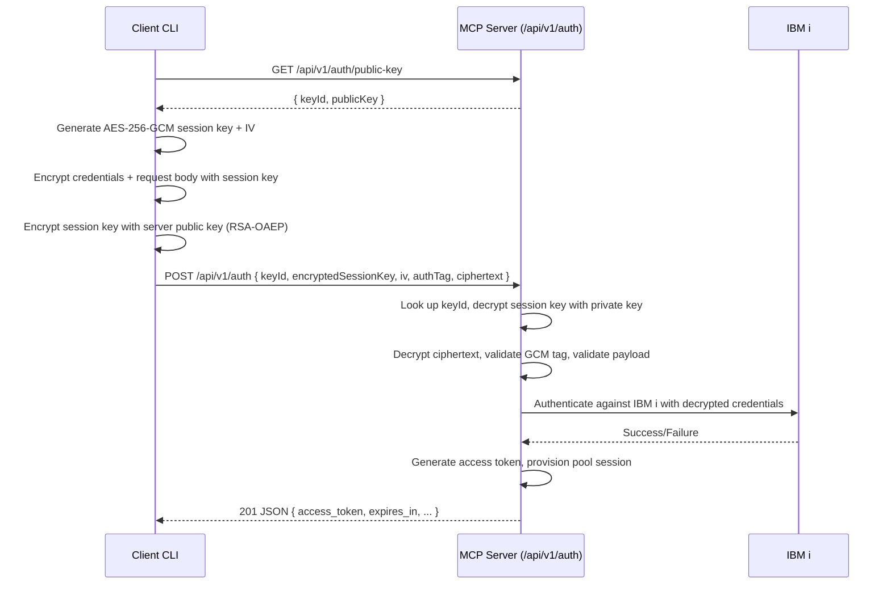

# Encrypted IBM i Auth – Review Snapshot

## What Changed

- **Server config (`src/config/index.ts`)** now recognizes new IBM i auth key settings (`IBMI_AUTH_KEY_ID`, `IBMI_AUTH_PRIVATE_KEY_PATH`, `IBMI_AUTH_PUBLIC_KEY_PATH`). When HTTP auth is enabled, startup fails fast unless those values are present. The schema also keeps upstream additions (`YAML_AUTO_RELOAD`, `SELECTED_TOOLSETS`).

- **Auth crypto helpers (`src/ibmi-mcp-server/auth/crypto.ts`, `src/ibmi-mcp-server/auth/types.ts`)** load the RSA keypair, offer the public key for clients, and decrypt the RSA-wrapped AES session key plus the AES-GCM payload.

- **Auth endpoint (`src/ibmi-mcp-server/auth/httpAuthEndpoint.ts`)** replaces Basic Auth parsing with the new envelope format. It now decrypts the body, validates the decoded credentials/host/pool settings, and then follows the existing token/pool creation path.

- **HTTP transport (`src/mcp-server/transports/http/httpTransport.ts`)** exposes `GET /api/v1/auth/public-key` so clients can fetch the server’s public key. The earlier MCP auth route remains intact.

- **CLI (`get-access-token.js`)** fetches the public key, generates an AES-256-GCM session key, encrypts credentials + request options, and posts the encrypted envelope. It still supports `.env` fallbacks, verbose logging, and `--quiet` mode.

- **Env templates (`.env`)** document the new key-path env vars and keep upstream’s IBM i HTTP auth defaults.

## Sequence Overview



## Why

Plain Basic Auth sent credentials base64-encoded (effectively cleartext over HTTP). The new flow enforces that IBM i usernames/passwords are encrypted client-side with the server’s public key, eliminating the exposure if TLS is disabled in development and strengthening defense in depth in production.

## Flow

1. Start with `src/ibmi-mcp-server/auth/httpAuthEndpoint.ts` to see the new request validation flow.
2. Inspect `src/ibmi-mcp-server/auth/crypto.ts` for key handling + AES/RSA usage; pay attention to error messaging.
3. Check `get-access-token.js` to confirm the client is building the envelope you expect (env overrides, `--public-key-path`).
4. Review `src/mcp-server/transports/http/httpTransport.ts` for the public-key route + ensure it coexists with existing YAML auto-reload changes.
5. Verify `.env`

Manual validation: generate a keypair (`openssl` command), set the env vars, restart `npm run start:http`, and run the CLI. You should get a token; tampered payloads should trigger 400s with decrypt errors.

1. **Prepare keys**
   - Generate an RSA keypair (example):
     ```bash
     mkdir -p secrets
     openssl genpkey -algorithm RSA -out secrets/private.pem -pkeyopt rsa_keygen_bits:2048
     openssl rsa -pubout -in secrets/private.pem -out secrets/public.pem
     ```
   - Set env vars (shell or `.env`):
     ```bash
     export IBMI_AUTH_KEY_ID=prod-2025-01
     export IBMI_AUTH_PRIVATE_KEY_PATH=secrets/private.pem
     export IBMI_AUTH_PUBLIC_KEY_PATH=secrets/public.pem
     export IBMI_HTTP_AUTH_ENABLED=true
     export IBMI_AUTH_ALLOW_HTTP=true        # optional, dev only
     export DB2i_HOST=...
     export DB2i_USER=...
     export DB2i_PASS='...'
     ```
