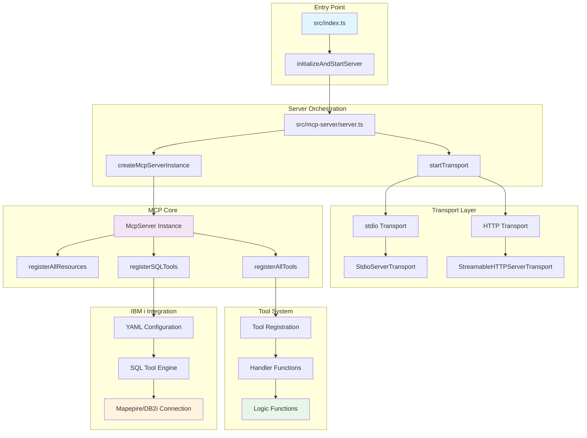
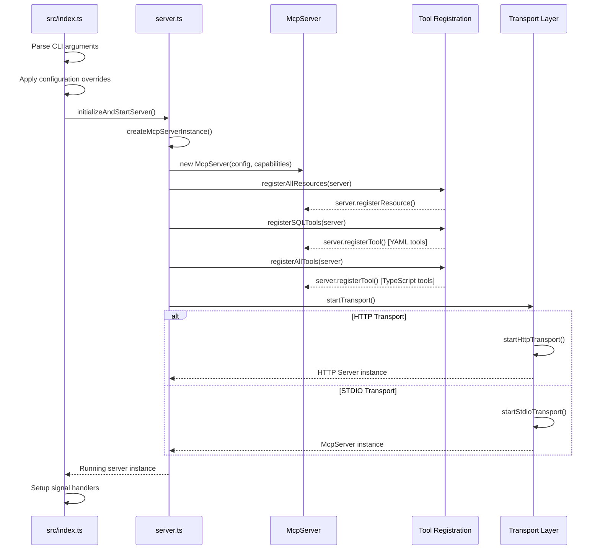
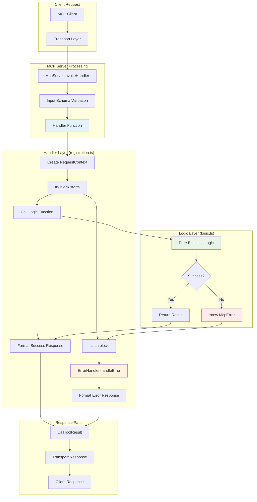
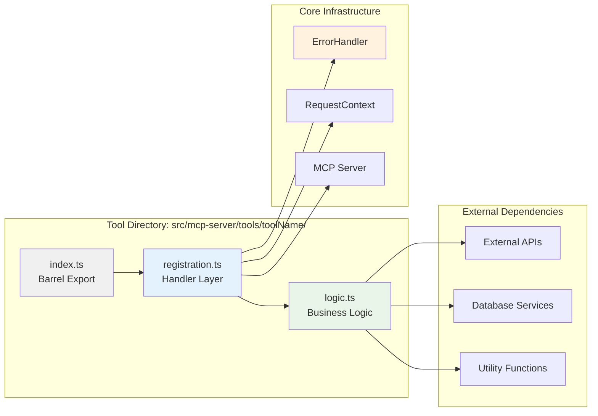
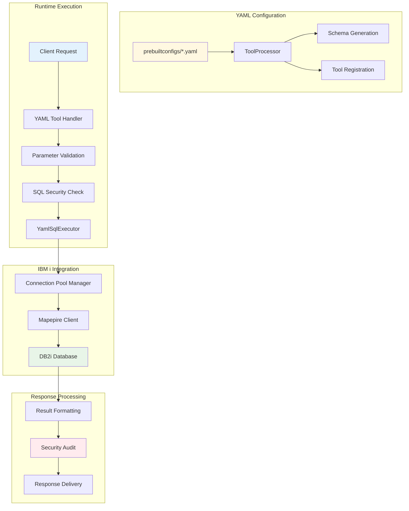
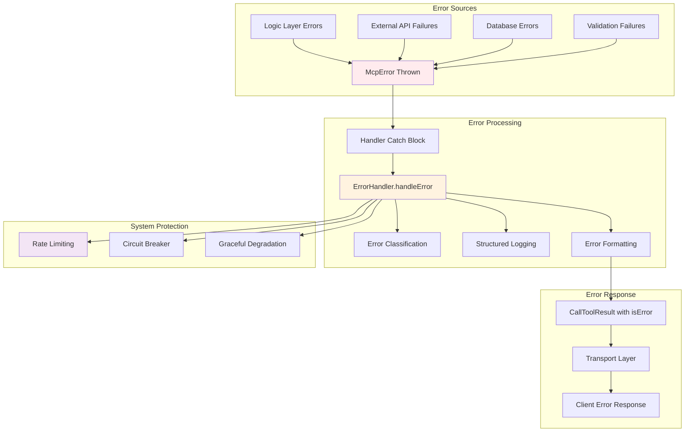
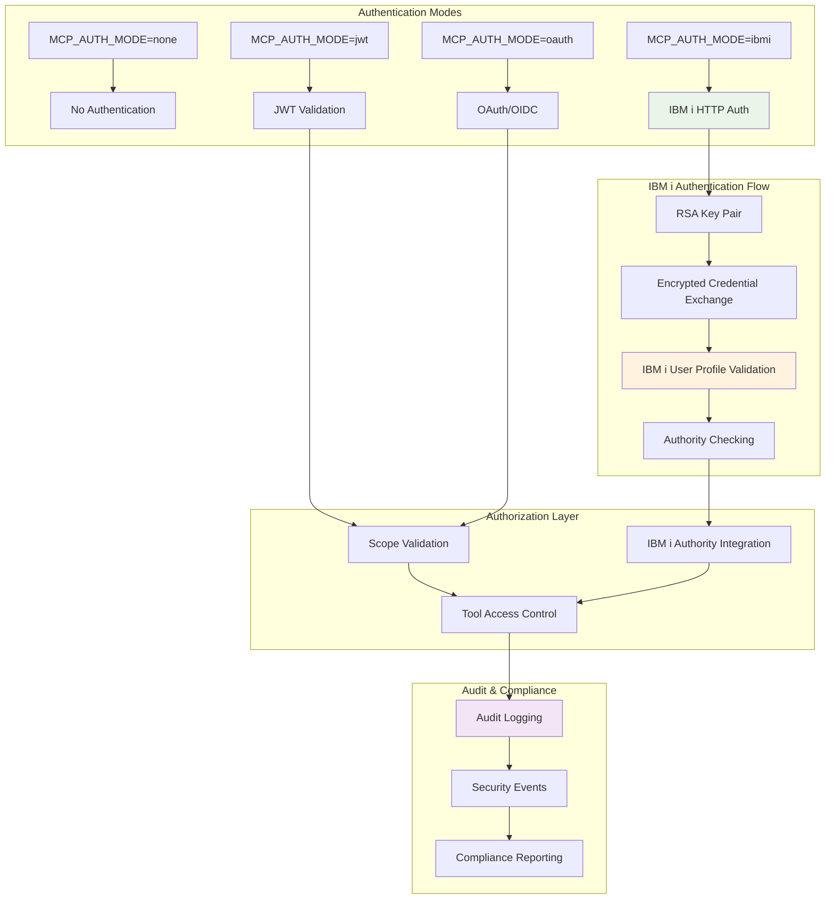
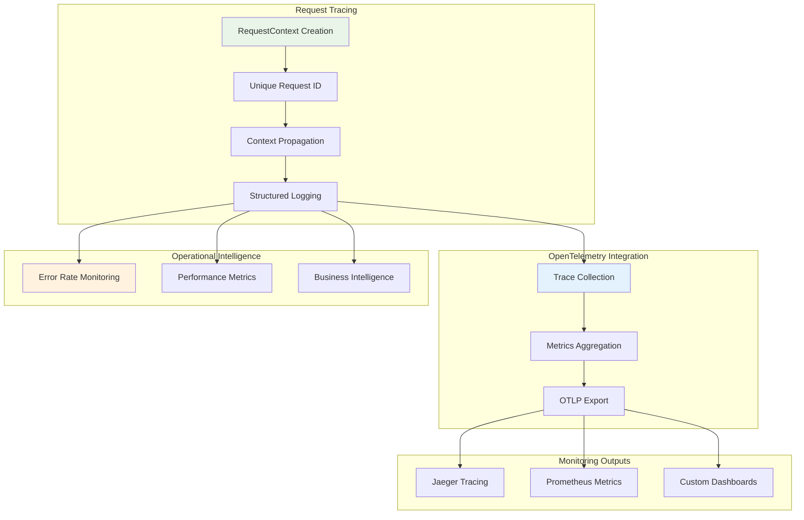

# Server Architecture

The IBM i MCP Server follows a carefully designed architecture that ensures modularity, testability, and operational clarity through strict separation of concerns. This guide explores the core architectural patterns and component interactions.

<Note>
The architecture is built around the **"Logic Throws, Handler Catches"** principle, which forms the foundation of our error-handling and control-flow strategy.
</Note>

## Core Architectural Principles

### 1. Logic Throws, Handler Catches

This immutable pattern ensures clean separation between business logic and transport handling:

<Tabs>
  <Tab title="Logic Layer (logic.ts)">
    **Responsibilities:**
    - Execute pure business logic
    - Remain stateless and self-contained
    - Terminate by throwing structured `McpError` on failure
    - Never contain try...catch blocks for response formatting

    ```typescript
    // Example from catFactFetcher/logic.ts
    export async function catFactFetcherLogic(
      params: CatFactFetcherInput,
    ): Promise<CatFactFetcherResponse> {
      // Pure business logic execution
      if (params.message === "fail") {
        throw new McpError(
          BaseErrorCode.VALIDATION_ERROR,
          "Deliberate failure triggered",
          { toolName: "cat_fact_fetcher" }
        );
      }
      return processedResult;
    }
    ```
  </Tab>

  <Tab title="Handler Layer (registration.ts)">
    **Responsibilities:**
    - Interface with transport layer (MCP, HTTP)
    - Wrap logic calls in try...catch blocks
    - Format responses using `ErrorHandler`
    - Manage final response lifecycle

    ```typescript
    // Example from catFactFetcher/registration.ts
    async (params: CatFactFetcherInput) => {
      try {
        const result = await catFactFetcherLogic(params, context);
        return {
          structuredContent: result,
          content: [{ type: "text", text: JSON.stringify(result, null, 2) }]
        };
      } catch (error) {
        const mcpError = ErrorHandler.handleError(error, { context });
        return {
          isError: true,
          content: [{ type: "text", text: `Error: ${mcpError.message}` }]
        };
      }
    }
    ```
  </Tab>
</Tabs>

### 2. Structured Request Context

Every operation maintains traceability through structured logging:

```typescript
const context = requestContextService.createRequestContext({
  operation: "HandleToolRequest",
  toolName: TOOL_NAME,
  input: params,
});
```

## Application Architecture Overview



## Server Startup Sequence

The application follows a precise startup sequence ensuring all components are properly initialized:



<Note>
**Key Architectural Decision**: The startup sequence registers ALL tools during initialization, not on-demand. This ensures consistent tool availability and enables proper error handling during startup rather than runtime failures.
</Note>

## Tool Execution Flow

Every tool follows the same execution pattern, ensuring consistency and reliability:



## Component Architecture

### Tool Development Structure

Each tool follows a mandated three-file structure that enforces the architectural patterns:



### SQL Tools Architecture

IBM i-specific SQL tools use a YAML-driven approach for rapid development:



## Error Handling Architecture

The error handling system provides comprehensive coverage while maintaining system stability:



## Authentication & Security Architecture

The server supports multiple authentication modes with integrated IBM i security:



## Transport Layer Architecture

The server supports both development and production transport modes:

<Tabs>
  <Tab title="STDIO Transport">
    **Use Cases:**
    - CLI tools and MCP Inspector
    - Direct process communication
    - Development and testing

    ```mermaid
    graph LR
        A[MCP Client Process] <--> B[stdin/stdout]
        B <--> C[StdioServerTransport]
        C <--> D[McpServer Instance]
        D <--> E[Tool Handlers]
    ```
  </Tab>

  <Tab title="HTTP Transport">
    **Use Cases:**
    - Web applications and REST APIs
    - Production deployments
    - Load balancing and scaling

    ```mermaid
    graph LR
        A[HTTP Client] --> B[HTTP Request]
        B --> C[StreamableHTTPServerTransport]
        C --> D[Session Management]
        D --> E[McpServer Instance]
        E --> F[Tool Handlers]
        F --> G[Server-Sent Events]
        G --> H[HTTP Response]
    ```
  </Tab>
</Tabs>

## Observability & Monitoring

The architecture includes comprehensive observability features:



## Best Practices & Patterns

<AccordionGroup>
  <Accordion title="Tool Development Guidelines" icon="code">
    - **Logic Purity**: Keep business logic functions pure and stateless
    - **Error Throwing**: Always throw `McpError` for failures in logic layer
    - **Handler Wrapping**: Every logic call must be wrapped in try...catch in handlers
    - **Context Propagation**: Pass `RequestContext` through the entire call stack
    - **Schema Validation**: Define comprehensive Zod schemas for inputs and outputs
  </Accordion>

  <Accordion title="YAML SQL Tool Patterns" icon="database">
    - **Parameter Security**: Use parameter binding to prevent SQL injection
    - **Authority Checking**: Include appropriate IBM i authority requirements
    - **Result Limiting**: Always include row limits for large result sets
    - **Audit Logging**: Mark sensitive operations with `security.audit: true`
    - **Performance Consideration**: Design queries for production system impact
  </Accordion>

  <Accordion title="Error Handling Standards" icon="exclamation-triangle">
    - **Structured Errors**: Always use `McpError` with appropriate error codes
    - **Context Inclusion**: Include relevant context in error details
    - **No Silent Failures**: Every error must be logged and handled
    - **Graceful Degradation**: Provide meaningful fallback behaviors
    - **Client Communication**: Return user-friendly error messages
  </Accordion>

  <Accordion title="Security Implementation" icon="shield-check">
    - **Input Validation**: Validate all inputs with Zod schemas
    - **Authorization Checks**: Verify scope requirements for sensitive operations
    - **IBM i Integration**: Leverage IBM i's built-in security model
    - **Audit Trails**: Maintain comprehensive audit logs
    - **Credential Management**: Use environment variables for sensitive data
  </Accordion>
</AccordionGroup>

## Integration Points

The architecture provides multiple integration points for extending functionality:

<CardGroup cols={2}>
  <Card title="Custom SQL Tools" icon="wrench" href="/sql-tools/building-tools">
    Extend functionality with YAML SQL configurations for IBM i database operations
  </Card>
  <Card title="Agent Development" icon="robot" href="/agents/building-agents">
    Build AI agents that understand the server architecture and IBM i concepts
  </Card>
  <Card title="Authentication Providers" icon="key" href="/api/auth-endpoints">
    Implement custom authentication modes and IBM i security integration
  </Card>
  <Card title="Production Deployment" icon="chart-line" href="/deployment/production">
    Connect observability data to enterprise monitoring and alerting systems
  </Card>
</CardGroup>

<Note>
For complete configuration details including environment variables for each architectural component, see the [Configuration Reference](/configuration).
</Note>

<Note>
**Architectural Philosophy**: The "Logic Throws, Handler Catches" pattern ensures that business logic remains testable and pure, while handlers manage the complexity of transport protocols and error formatting. This separation enables reliable unit testing and makes the system easier to maintain and extend.
</Note>

<Note>
This architecture has been battle-tested in enterprise IBM i environments and follows industry best practices for production MCP server deployment. The modular design ensures that each component can be developed, tested, and maintained independently while working together as a cohesive system.
</Note>