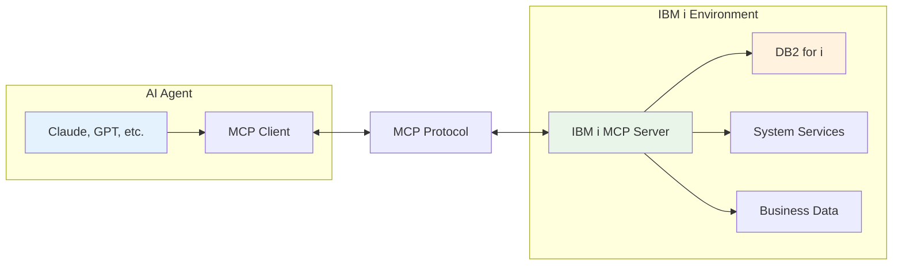
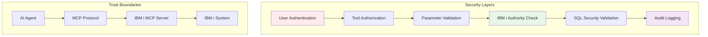

# Understanding the Model Context Protocol (MCP)

The Model Context Protocol (MCP) is an open standard that enables AI agents to securely access and interact with your data and systems. For IBM i professionals, MCP provides a bridge between modern AI applications and traditional enterprise systems, maintaining the security and reliability standards you expect.

<Note>
Think of MCP as a standardized API that AI agents understand natively. Instead of building custom integrations for each AI tool, MCP provides a universal interface that works with any MCP-compatible agent.
</Note>

## What Problem Does MCP Solve?

Traditional AI applications face significant challenges when working with enterprise data:

<Columns cols={2}>
  <Card title="Data Silos" icon="database">
    Enterprise data locked in systems that AI can't easily access
  </Card>
  <Card title="Security Concerns" icon="shield-exclamation">
    Exposing sensitive data through broad API access or data dumps
  </Card>
  <Card title="Integration Complexity" icon="network-wired">
    Building custom connectors for every AI tool and data source
  </Card>
  <Card title="Maintenance Overhead" icon="wrench">
    Managing multiple integration points and authentication methods
  </Card>
</Columns>

MCP solves these problems by providing a **standardized, secure, and controlled way** for AI agents to access exactly the data they need, when they need it.

## MCP in IBM i Environments

For IBM i systems, MCP is particularly valuable because it:

<AccordionGroup>
  <Accordion title="Preserves IBM i Security Model" icon="lock">
    MCP integrates with IBM i's comprehensive security system, respecting user profiles, object authorities, and audit requirements. AI agents can only access data that the authenticated user has permission to see.

    ```
    User JSMITH → MCP Server → DB2i (as JSMITH)
    ✓ Inherits JSMITH's authorities
    ✓ Audit trail maintained
    ✓ Object-level security enforced
    ```
  </Accordion>

  <Accordion title="Enables Modern AI Workflows" icon="robot">
    Connect cutting-edge AI agents to decades of business-critical data stored in DB2 for i, without compromising on security or performance.

    **Example Use Cases:**
    - AI-powered business intelligence and reporting
    - Automated system monitoring and alerting
    - Intelligent data analysis and trend identification
    - Natural language queries against business data
  </Accordion>

  <Accordion title="Maintains Enterprise Standards" icon="building">
    MCP implementations can include comprehensive logging, audit trails, and compliance features required in regulated industries.

    **Enterprise Features:**
    - OpenTelemetry integration for observability
    - Structured audit logging for compliance
    - Rate limiting and resource protection
    - Multi-environment configuration management
  </Accordion>
</AccordionGroup>

## How MCP Works: A High-Level View

MCP creates a three-party interaction between your data, the MCP server, and AI agents:



### The MCP Conversation Flow

Here's what happens when an AI agent needs information from your IBM i system:

<Tabs>
  <Tab title="1. Agent Request">
    The AI agent identifies a need for data and makes a request through MCP:

    ```json
    {
      "method": "tools/call",
      "params": {
        "name": "query_active_jobs",
        "arguments": {
          "user_filter": "ACCOUNTING",
          "max_rows": 10
        }
      }
    }
    ```
  </Tab>

  <Tab title="2. Server Processing">
    The MCP server validates the request and executes it against IBM i:

    - ✅ Authentication check (is user authorized?)
    - ✅ Parameter validation (are inputs safe?)
    - ✅ Authority verification (can user access this data?)
    - ✅ SQL execution with proper binding
    - ✅ Result formatting and return
  </Tab>

  <Tab title="3. Structured Response">
    The agent receives structured data it can understand and act upon:

    ```json
    {
      "content": [{
        "type": "text",
        "text": "Found 8 active jobs for ACCOUNTING department..."
      }],
      "structuredContent": {
        "jobs": [
          {"job_name": "PAYROLL01", "user": "ACCUSER1", "status": "ACTIVE"},
          {"job_name": "REPORTS", "user": "ACCUSER2", "status": "ACTIVE"}
        ]
      }
    }
    ```
  </Tab>
</Tabs>

## MCP Components and Concepts

Understanding these key concepts will help you work effectively with MCP:

### Tools

**Tools** are discrete operations that AI agents can perform through MCP. In the IBM i context, tools typically:

<Columns cols={2}>
  <Card title="Query Data" icon="search">
    Execute SQL queries against DB2 for i tables and views

    ```yaml
    tools:
      system_status:
        description: "Get current system performance metrics"
        statement: "SELECT * FROM qsys2.system_status_info"
    ```
  </Card>

  <Card title="System Operations" icon="cog">
    Perform system administration tasks and monitoring

    ```yaml
    tools:
      check_subsystems:
        description: "List active subsystem status"
        statement: "SELECT * FROM qsys2.subsystem_info WHERE status = 'ACTIVE'"
    ```
  </Card>

  <Card title="Business Logic" icon="calculator">
    Execute stored procedures and business functions

    ```yaml
    tools:
      calculate_inventory:
        description: "Run inventory calculation procedure"
        statement: "CALL mylib.calc_inventory(:product_line)"
    ```
  </Card>

  <Card title="Report Generation" icon="chart-bar">
    Generate formatted reports and summaries

    ```yaml
    tools:
      monthly_sales:
        description: "Generate monthly sales summary"
        statement: "SELECT * FROM sales_summary WHERE month = :target_month"
    ```
  </Card>
</Columns>

### Resources

**Resources** represent data that can be retrieved and analyzed. Unlike tools that perform actions, resources provide static or semi-static content:

- Configuration files and documentation
- Reference data and lookup tables
- System catalogs and metadata
- Log files and audit trails

### Capabilities

MCP servers declare their **capabilities** to inform clients about supported features:

```json
{
  "capabilities": {
    "resources": { "listChanged": true },
    "tools": { "listChanged": true },
    "logging": {}
  }
}
```

## IBM i MCP Server Capabilities

The IBM i MCP Server provides enterprise-grade capabilities specifically designed for IBM i environments:

<CardGroup cols={2}>
  <Card title="YAML-Defined SQL Tools" icon="file-code">
    Create powerful SQL operations using simple YAML configurations without writing TypeScript code.
  </Card>

  <Card title="IBM i Authentication" icon="key">
    Integrated authentication supporting IBM i user profiles and HTTP auth with RSA encryption.
  </Card>

  <Card title="Authority Integration" icon="shield-check">
    Respects IBM i object authorities, special authorities, and security requirements.
  </Card>

  <Card title="Audit & Compliance" icon="clipboard-check">
    Comprehensive audit logging for regulatory compliance and security monitoring.
  </Card>

  <Card title="Production Ready" icon="server">
    Enterprise features including OpenTelemetry, error handling, and operational monitoring.
  </Card>

  <Card title="Multi-Transport" icon="arrows-alt">
    Supports both STDIO (development) and HTTP (production) transport modes.
  </Card>
</CardGroup>

## Security and Trust Model

MCP implements a security model based on **explicit consent and minimal access**:



### Key Security Principles

<AccordionGroup>
  <Accordion title="Principle of Least Privilege" icon="lock">
    AI agents can only access tools and data explicitly made available through the MCP server configuration. There's no blanket access to your systems.

    ```yaml
    # Only specific tools are exposed
    toolsets:
      read_only_reports:
        tools: [sales_summary, inventory_levels]
        # No access to payroll, financial, or system administration tools
    ```
  </Accordion>

  <Accordion title="Authentication Required" icon="user-check">
    All access requires valid authentication. The IBM i MCP Server supports multiple auth modes including IBM i HTTP authentication with encrypted credential exchange.

    ```bash
    # User must authenticate before any tool access
    MCP_AUTH_MODE=ibmi
    IBMI_HTTP_AUTH_ENABLED=true
    ```
  </Accordion>

  <Accordion title="Transparent Audit Trail" icon="eye">
    All operations are logged with full context, including user identity, requested operations, and results. Perfect for compliance and security monitoring.

    ```json
    {
      "timestamp": "2024-01-15T10:30:45.123Z",
      "user": "JSMITH",
      "tool": "query_customer_data",
      "parameters": {"customer_id": "12345"},
      "result": "success"
    }
    ```
  </Accordion>
</AccordionGroup>

## Getting Started with MCP

If you're new to MCP, here's your learning path:

<Steps>
  <Step title="Start with the Basics">
    Begin with our [Quick Start Guide](/quickstart) to get a basic MCP server running in your environment and test your first tool execution.
  </Step>

  <Step title="Understand the Architecture">
    Review the [Server Architecture](/concepts/architecture) to understand how components work together and the "Logic Throws, Handler Catches" pattern.
  </Step>

  <Step title="Create Your First Tools">
    Follow the [SQL Tools Guide](/sql-tools/building-tools) to create custom tools for your specific needs using YAML configurations.
  </Step>

  <Step title="Build an Agent">
    Explore [Agent Development](/agents/building-agents) to create AI agents that understand your business context and effectively use your tools.
  </Step>

  <Step title="Deploy to Production">
    Use our [Production Deployment](/deployment/production) guide for enterprise deployment with security, monitoring, and the [Configuration Reference](/configuration) for environment variables.
  </Step>
</Steps>

## MCP vs. Traditional Integration Approaches

Understanding how MCP compares to traditional integration methods helps illustrate its value:

<Tabs>
  <Tab title="Traditional REST APIs">
    **Challenges:**
    - Each AI tool needs custom integration
    - Broad API access often required
    - Complex authentication for each endpoint
    - Limited built-in security controls

    **MCP Advantages:**
    - Universal protocol works with any MCP client
    - Granular tool-level access control
    - Built-in authentication and authorization
    - Standardized security model
  </Tab>

  <Tab title="Database Direct Access">
    **Challenges:**
    - AI tools need database credentials
    - Difficult to audit and control access
    - No abstraction for business logic
    - Security risks with credential management

    **MCP Advantages:**
    - No direct database access required
    - User-level authentication and authorization
    - Business logic encapsulated in tools
    - Comprehensive audit trails
  </Tab>

  <Tab title="Data Exports/ETL">
    **Challenges:**
    - Data becomes stale quickly
    - Full datasets often exported for minimal needs
    - Complex data pipeline maintenance
    - Compliance and security concerns

    **MCP Advantages:**
    - Real-time data access
    - Query only what's needed
    - No data duplication
    - Native IBM i security integration
  </Tab>
</Tabs>

<Note>
**MCP's Key Innovation**: MCP enables AI agents to become **intelligent participants** in your existing business processes rather than external tools that need special integration. They can ask for specific data when needed, perform authorized operations, and maintain the same security standards as human users.
</Note>

## Industry Examples and Use Cases

MCP is being adopted across various industries for different purposes:

<CardGroup cols={2}>
  <Card title="Manufacturing" icon="industry">
    **Real-time Production Monitoring**
    - AI agents monitor production metrics
    - Automated quality control analysis
    - Predictive maintenance scheduling
    - Supply chain optimization
  </Card>

  <Card title="Financial Services" icon="dollar-sign">
    **Compliance and Risk Management**
    - Automated regulatory reporting
    - Risk assessment and monitoring
    - Fraud detection and analysis
    - Customer service automation
  </Card>

  <Card title="Healthcare" icon="heartbeat">
    **Patient Data Analysis**
    - Clinical decision support
    - Patient outcome tracking
    - Resource utilization optimization
    - Regulatory compliance reporting
  </Card>

  <Card title="Retail & Distribution" icon="shopping-cart">
    **Inventory and Sales Intelligence**
    - Demand forecasting
    - Inventory optimization
    - Customer behavior analysis
    - Pricing strategy optimization
  </Card>
</CardGroup>

## Common Questions from IBM i Professionals

<AccordionGroup>
  <Accordion title="Will this compromise our IBM i security?" icon="shield-alt">
    No. MCP enhances your security by providing controlled, audited access. AI agents authenticate as specific users and are subject to the same authority checking as any other user. All operations are logged and can be monitored.
  </Accordion>

  <Accordion title="Do we need to expose our database directly?" icon="database">
    No. The MCP server acts as a secure intermediary. Your database remains protected behind your firewall, and the MCP server only exposes specific, pre-defined operations that you configure and control.
  </Accordion>

  <Accordion title="How does this affect system performance?" icon="tachometer-alt">
    MCP servers are designed for efficient operation. SQL tools include row limiting, connection pooling, and resource management. You maintain full control over what operations are available and how they're executed.
  </Accordion>

  <Accordion title="What about compliance and audit requirements?" icon="gavel">
    MCP supports comprehensive audit logging, including user identity, requested operations, parameters, and results. This often provides better audit trails than traditional approaches while maintaining compliance requirements.
  </Accordion>

  <Accordion title="Can we integrate with existing monitoring tools?" icon="chart-line">
    Yes. The IBM i MCP Server includes OpenTelemetry integration for metrics and tracing, structured logging for SIEM integration, and health check endpoints for monitoring systems.
  </Accordion>
</AccordionGroup>

## Next Steps

Ready to explore MCP for your IBM i environment?

<CardGroup cols={2}>
  <Card title="Quick Start" icon="rocket" href="/quickstart">
    Get your first MCP server running in 15 minutes
  </Card>

  <Card title="SQL Tools" icon="database" href="/sql-tools/overview">
    Learn how to create powerful IBM i data access tools
  </Card>

  <Card title="Agent Development" icon="robot" href="/agents/building-agents">
    Build AI agents that understand your business
  </Card>

  <Card title="Production Setup" icon="server" href="/deployment/production">
    Deploy with enterprise security and monitoring
  </Card>
</CardGroup>

<Note>
MCP represents a fundamental shift in how AI systems interact with enterprise data. Instead of requiring you to adapt your systems for AI, MCP enables AI to work with your existing infrastructure, security models, and business processes.
</Note>