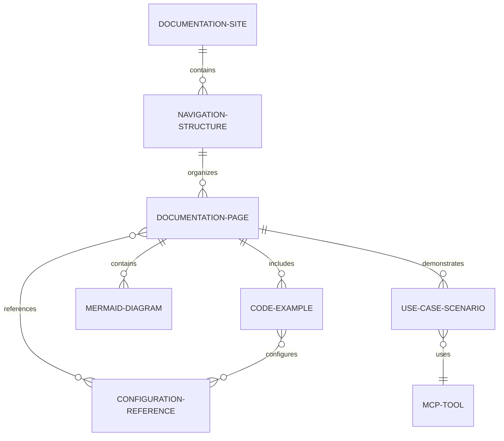

# Documentation Data Model

**Purpose**: Define the structure and relationships of documentation entities for the IBM i MCP Server documentation project.

## Core Entities

### Documentation Page
**Purpose**: Individual content units that provide specific information to users

**Attributes**:
- `title`: String (required) - H1 heading for the page
- `description`: String (required) - Meta description for SEO and navigation
- `audience`: Enum (required) - ["developer", "administrator", "all"]
- `difficulty`: Enum (required) - ["beginner", "intermediate", "advanced"]
- `file_path`: String (required) - Relative path from docs/ root
- `nav_order`: Integer (optional) - Order within navigation group
- `last_updated`: Date (required) - Content freshness indicator
- `related_pages`: Array[String] (optional) - Cross-reference links
- `prerequisites`: Array[String] (optional) - Required knowledge or setup

**Validation Rules**:
- Title must be unique within the documentation set
- File path must follow kebab-case naming convention
- Description must be 120-160 characters for optimal SEO
- Related pages must reference existing documentation pages

**State Transitions**:
- Draft → Review → Published → Archived
- Content updates trigger Review state

### Navigation Structure
**Purpose**: Hierarchical organization of documentation pages for user discovery

**Attributes**:
- `group_name`: String (required) - Navigation section title
- `group_order`: Integer (required) - Order in main navigation
- `pages`: Array[String] (required) - Ordered list of page file paths
- `icon`: String (optional) - Mintlify icon name
- `collapsed`: Boolean (default: false) - Initial collapsed state

**Validation Rules**:
- Group names must be unique
- Page references must exist in documentation pages
- Group order determines navigation sequence

**Relationships**:
- Contains multiple Documentation Pages
- Belongs to single Documentation Site

### Code Example
**Purpose**: Executable code snippets that demonstrate functionality

**Attributes**:
- `language`: Enum (required) - ["typescript", "javascript", "sql", "yaml", "bash", "json"]
- `title`: String (required) - Descriptive example title
- `code_content`: String (required) - Actual code content
- `validation_required`: Boolean (default: true) - Whether code must be executable
- `environment`: Enum (required) - ["development", "production", "any"]
- `dependencies`: Array[String] (optional) - Required setup or packages
- `expected_output`: String (optional) - Expected execution result

**Validation Rules**:
- SQL examples must use valid IBM i system services (QSYS2.*)
- YAML examples must validate against server schemas
- TypeScript examples must compile without errors
- No hardcoded credentials or sensitive data

**Relationships**:
- Belongs to one Documentation Page
- May reference Configuration References

### Mermaid Diagram
**Purpose**: Visual representations of architecture, flows, and relationships

**Attributes**:
- `diagram_type`: Enum (required) - ["flowchart", "sequence", "architecture", "entity_relationship"]
- `title`: String (required) - Diagram purpose description
- `mermaid_code`: String (required) - Valid Mermaid syntax
- `alt_text`: String (required) - Accessibility description
- `complexity`: Enum (required) - ["simple", "moderate", "complex"]

**Validation Rules**:
- Mermaid code must render without errors
- Alt text must describe diagram purpose and key elements
- Complex diagrams should include explanatory text
- Consistent styling across all diagrams

**Relationships**:
- Belongs to one Documentation Page
- May reference multiple Architecture Components

### Configuration Reference
**Purpose**: Environment variables and configuration options with validation

**Attributes**:
- `variable_name`: String (required) - Environment variable name
- `data_type`: Enum (required) - ["string", "integer", "boolean", "url", "file_path"]
- `required`: Boolean (required) - Whether variable is mandatory
- `default_value`: String (optional) - Default when not specified
- `description`: String (required) - Purpose and usage explanation
- `example_values`: Array[String] (required) - Valid example values
- `validation_pattern`: String (optional) - Regex for validation
- `security_sensitive`: Boolean (default: false) - Contains credentials

**Validation Rules**:
- Variable names must follow environment variable conventions (UPPERCASE_SNAKE_CASE)
- Example values must match data type and validation pattern
- Security sensitive variables must not show actual values in examples

**Relationships**:
- Referenced by Configuration Documentation Pages
- Used in Code Examples

### Use Case Scenario
**Purpose**: Real-world scenarios demonstrating server capabilities

**Attributes**:
- `scenario_name`: String (required) - Descriptive scenario title
- `business_context`: String (required) - Why this scenario matters
- `user_roles`: Array[String] (required) - Who would use this scenario
- `steps`: Array[Object] (required) - Sequential implementation steps
- `tools_used`: Array[String] (required) - MCP tools involved
- `expected_outcome`: String (required) - Success criteria
- `troubleshooting_notes`: Array[String] (optional) - Common issues

**Step Object**:
- `step_number`: Integer (required)
- `action`: String (required) - What to do
- `code_example`: String (optional) - Implementation code
- `verification`: String (optional) - How to confirm success

**Validation Rules**:
- Steps must be sequential and complete
- Tools used must reference actual server tools
- Code examples must be validated and executable

**Relationships**:
- References multiple MCP Tools
- Contains multiple Code Examples
- Belongs to Use Case Documentation Pages

## Entity Relationships

### Primary Relationships

### Content Validation Relationships
- Code Examples validate against Configuration References
- Use Case Scenarios verify against actual MCP Tools
- Cross-references validate against existing Documentation Pages
- Mermaid Diagrams render successfully in Mintlify environment

## Data Volume Estimates

**Documentation Pages**: ~25-30 pages
- Getting Started: 5 pages
- Configuration: 3 pages
- SQL Tools: 6 pages
- Agents: 4 pages
- Deployment: 4 pages
- API Reference: 3 pages
- Use Cases: 4 pages

**Code Examples**: ~60-80 examples
- 2-3 examples per documentation page
- Multiple language variants for key concepts
- Validated examples from actual server implementation

**Mermaid Diagrams**: ~10-15 diagrams
- Architecture overview
- Authentication flows
- Tool execution sequences
- Deployment patterns

**Configuration References**: ~35-40 variables
- Based on current environment variable count
- Categorized by functionality (auth, database, transport)

**Use Case Scenarios**: ~8-12 scenarios
- 2-3 scenarios per major use case category
- Complete end-to-end workflows

## Content Lifecycle

### Creation Workflow
1. **Draft**: Initial content creation from server code analysis
2. **Technical Review**: Validation against actual server implementation
3. **Content Review**: Editorial review for clarity and completeness
4. **Validation**: Code examples and links verified
5. **Published**: Live documentation available to users

### Maintenance Workflow
1. **Server Changes**: Code changes trigger documentation review
2. **Content Updates**: Documentation updates follow server releases
3. **Link Validation**: Automated checks for broken references
4. **User Feedback**: Integration with documentation feedback systems

### Quality Assurance
- All code examples must be executable
- All configuration references must be current
- All cross-references must resolve correctly
- All diagrams must render properly in Mintlify