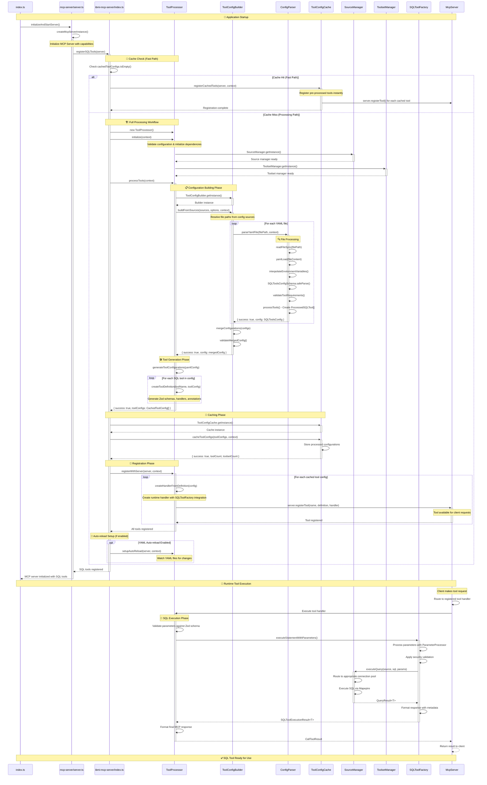

# MCP Server SQL Tools Loading Sequence

This document provides a comprehensive end-to-end sequence diagram showing how SQL tools are loaded, processed, and registered in the IBM i MCP Server.

## Overview

The SQL tools loading process follows a systematic 3-step workflow:

1. **Parse & Validate** - YAML configurations are loaded and validated
2. **Process & Cache** - Tools are processed into standardized configurations
3. **Register & Activate** - Tools are registered with the MCP server

## Architecture Components

- **ToolProcessor**: Orchestrates the entire SQL tool loading workflow
- **ToolConfigBuilder**: Builds and merges YAML configurations from multiple sources
- **ConfigParser**: Parses and validates individual YAML files
- **ToolConfigCache**: Caches processed tool configurations for performance
- **SourceManager**: Manages database connection pools for SQL execution
- **SQLToolFactory**: Executes SQL statements with parameter binding

## Sequence Diagram

## Key Phases Breakdown

### 1. **Startup & Cache Check**

- Application starts and initializes MCP server
- Checks for cached tool configurations for fast startup
- Falls back to full processing if cache is empty

### 2. **Configuration Processing** (Cache Miss Path)

- **File Discovery**: Resolves YAML file paths from configuration
- **Parsing**: Each YAML file is loaded, validated, and parsed
- **Merging**: Multiple configurations are merged into a unified config
- **Validation**: Ensures all tool references and dependencies are valid

### 3. **Tool Generation**

- **Schema Generation**: Creates Zod input/output schemas for each tool
- **Handler Creation**: Builds runtime handlers that integrate with SQLToolFactory
- **Metadata Processing**: Applies annotations, toolset assignments, security configs

### 4. **Caching & Registration**

- **Caching**: Stores processed configurations for future fast startup
- **Registration**: Registers each tool with the MCP server instance
- **Auto-reload**: Sets up file watching for development workflow

### 5. **Runtime Execution**

- **Request Routing**: MCP server routes client requests to appropriate handlers
- **Parameter Processing**: Validates and processes SQL parameters
- **SQL Execution**: Executes queries via connection pools with security validation
- **Response Formatting**: Returns structured results to clients

## Performance Optimizations

- **Caching**: Processed tool configurations are cached to avoid reprocessing
- **Lazy Initialization**: Database connections are created only when needed
- **Batch Processing**: Multiple YAML files are processed efficiently
- **Connection Pooling**: Database connections are pooled and reused

## Error Handling

- **Graceful Degradation**: Failed tools don't prevent others from loading
- **Detailed Logging**: Comprehensive logging throughout the entire process
- **Validation**: Multiple validation layers prevent runtime errors
- **Recovery**: Auto-reload functionality handles configuration changes

This sequence represents the complete lifecycle from server startup to ready-to-use SQL tools accessible via the MCP protocol.
